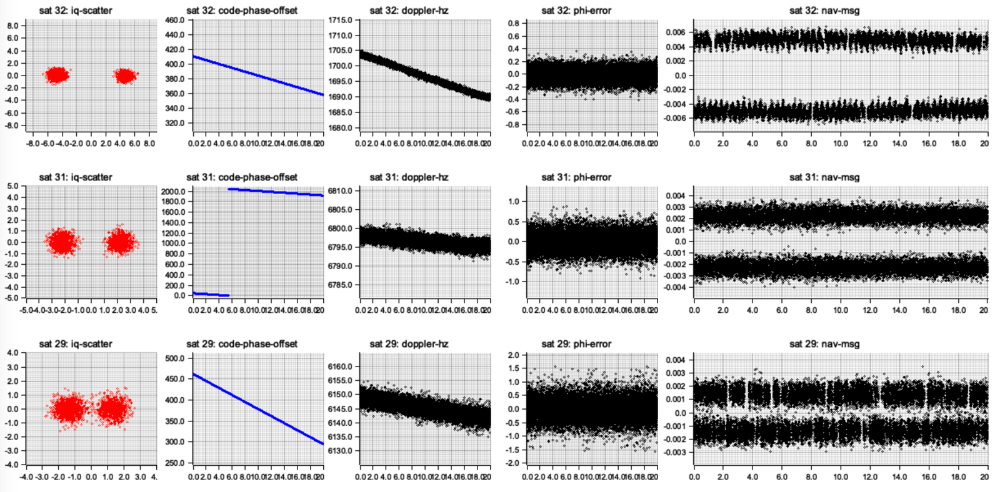

# gnss-rcv: GPS L1 C/A acquisition
This app takes as input:
 - an SDR IQ recording
 - or an rtl-sdr device (WIP)
.. and performs signal acquisition, tracking and ephemeris decoding. Finally it attempts to get a position fix. This is still a work in progress.

## Output diagnostic
As the gnss receiver processes the IQ data it periodically generates a diagnostic image in an output folder that helps explain the inner state of the decoder.



## Run gnss-rcv
### With IQ recording of L1 signal at 2046MHz
```
# RUST_LOG=warn cargo run --release -- -f path/to/recording.bin
```
Note that the app supports multiple IQ file formats: i8, 2xf16, 2xf32, etc.

### Use rtl-sdr:
```
# RUST_LOG=warn cargo run --release -- -d
```

## Download an existing IQ recording with GPS L1 signal

The one I used for most of the development, download and unzip:
https://github.com/codyd51/gypsum/releases/download/1.0/nov_3_time_18_48_st_ives.zip
.. then move the file under resources/. Use "-t 2xf32".

A few online SDR recordings at 1575,42 MHz are available online:
- https://jeremyclark.ca/wp/telecom/rtl-sdr-for-satellite-gps/
- https://s-taka.org/en/gnss-sdr-with-rtl-tcp/
- https://destevez.net/2022/03/timing-sdr-recordings-with-gps/

## Simulate a GPS SDR recording
Cf [GPS-SDR-SIM](https://github.com/osqzss/gps-sdr-sim)
```
 ./gps-sdr-sim -b 16 -d 60 -t 2022/01/01,01:02:03 -l 35.681298,139.766247,10.0 -e brdc0010.22n -s 2046000
```
This generates an IQ recording w/ 2 int16 per I and Q sample.
You can use this using the cmd-line option "-t 2xf16".

## Record from rtl-sdr to file
- you need to activate bias-t and power the gps/lna antenna:
```
$ rtl_biast -d 0 -b 1
```
- command to sample L1 at 2046KHz for 10 sec:
```
$ rtl_sdr -f 1575420000 -s 2046000 -n 20460000 output.bin
```

## Resources:
- [RTL-SDR](https://www.rtl-sdr.com/buy-rtl-sdr-dvb-t-dongles/)
- [Software Defined GPS](https://www.ocf.berkeley.edu/~marsy/resources/gnss/A%20Software-Defined%20GPS%20and%20Galileo%20Receiver.pdf)
- [GPS-SDR-SIM](https://github.com/osqzss/gps-sdr-sim)
- [Python GPS software: Gypsum](https://github.com/codyd51/gypsum)
- [SWIFT-NAV](https://github.com/swift-nav/libswiftnav)
- [Raw GPS Signal](http://www.jks.com/gps/gps.html)
- [PocketSDR](https://github.com/tomojitakasu/PocketSDR/)

## TODO
- finish position fix computation
- handle different sampling frequencies
- add a minimal UI: ratatui/egui
- support: SBAS
- support: Galileo, QZSS, Beidu.
